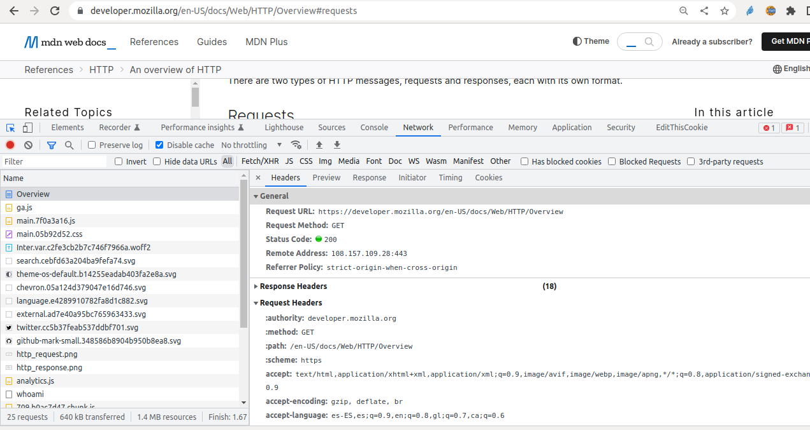

{}
* https://developer.mozilla.org/en-US/docs/Web/HTTP/Overview#requests
{}

## Elementos de una petición

* Método
* URI / URL o path
* Versión del protocolo HTTP
* Cabeceras adicionales
* Cuerpo (opcional)

## Inspecciona las cabeceras de una petición con las DevTools

* Abre una página con tu navegador y pulsa `MAYUS + Ctrl + C` o `MAYUS + Cmd + C`

