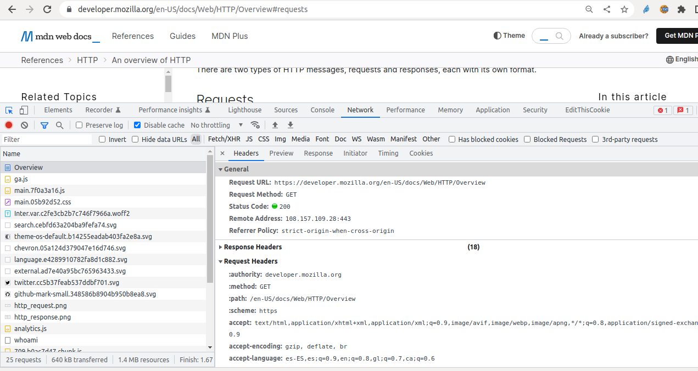

{}
* https://developer.mozilla.org/en-US/docs/Web/HTTP/Overview#requests
{}

## Elementos de una petición

* Método
* URI / URL o path
* Versión del protocolo HTTP
* Cabeceras adicionales
* Cuerpo (opcional)

## Inspecciona las cabeceras de una petición con las DevTools

* Abre una página con tu navegador y pulsa `MAYUS + Ctrl + C` o `MAYUS + Cmd + C`



## Inspección con `curl`
Puedes usar también curl para inspeccionar las cabeceras de una petición:

```shell
$ curl -I https://www.google.com

HTTP/1.1 200 OK
Content-Type: text/html; charset=ISO-8859-1
...
```

En Windows tendrás que instalar curl antes. https://curl.se/windows/ Puedes usar también la máquina virtual que has creado:

```shell
c:> cd <directorio con la máquina virtual (Vagratnfile)>
c:> vagrnant up
c:> vagrant ssh
vagrant@vagrant:~$ curl -I https://www.google.com
```
